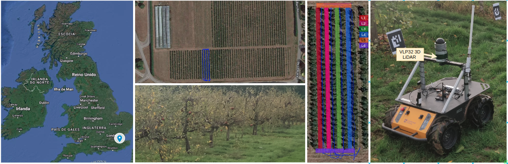
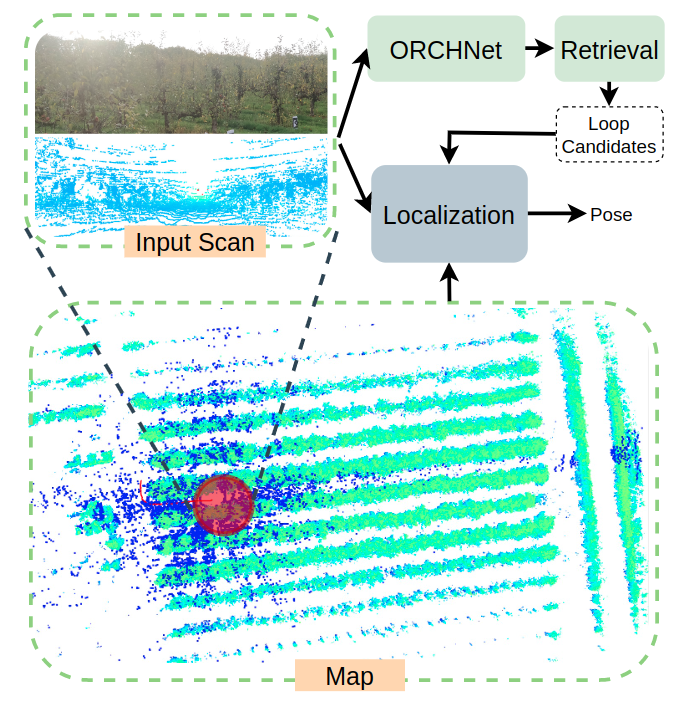
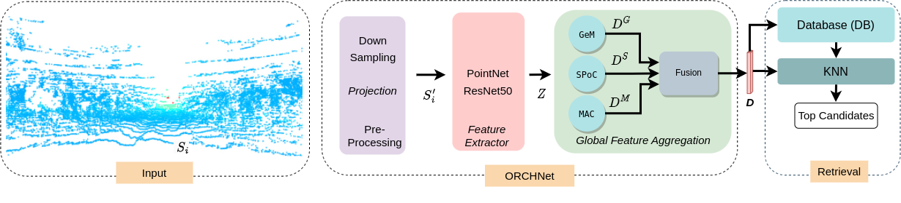

## ORCHNet: A Robust Global Feature Aggregation approach for 3D LiDAR-based Place recognition in Orchards

### T. Barros, L. Garrote, P. Conde, M.J. Coombes, C. Liu, C. Premebida, U.J. Nunes
\
Robust and reliable place recognition and loop closure detection in agricultural environments is still an open problem. In particular,  orchards are a difficult case study due to structural similarity across the entire field. In this work, we address the place recognition problem in orchards resorting to 3D LiDAR data, which is considered a key modality for robustness. 
Hence, we propose ORCHNet, a deep-learning-based approach that maps 3D-LiDAR scans to global descriptors. Specifically, this work proposes a new global feature aggregation approach, which fuses multiple aggregation methods into a robust global descriptor. 
ORCHNet is evaluated on real-world data collected in orchards, comprising data from the summer and autumn seasons.  To assess the robustness, We compare ORCHNet with state-of-the-art aggregation approaches on data from the same season and across seasons.

## Citations

The preprint has been submitted to IEEE Robotics & Automation Magazine

Preprint: https://arxiv.org/abs/2303.00477

### Orchard Dataset

## ORCHNet

### Localization Pipeline

## Pre-trained and Dataset Models
Pre-trained models and dataset will be available after the publication of the paper
  

## License

### Copyright (c) 2023 T. Barros, L. Garrote, P. Conde, M.J. Coombes, C. Liu, C. Premebida, U.J. Nunes

Permission is hereby granted, free of charge, to any person obtaining a copy of this software and associated documentation files (the "Software"), to deal in the Software without restriction, including without limitation the rights to use, copy, modify, merge, publish, distribute, sublicense, and/or sell copies of the Software, and to permit persons to whom the Software is furnished to do so, subject to the following conditions:

The above copyright notice and this permission notice shall be included in all copies or substantial portions of the Software.

THE SOFTWARE IS PROVIDED "AS IS", WITHOUT WARRANTY OF ANY KIND, EXPRESS OR IMPLIED, INCLUDING BUT NOT LIMITED TO THE WARRANTIES OF MERCHANTABILITY, FITNESS FOR A PARTICULAR PURPOSE AND NONINFRINGEMENT. IN NO EVENT SHALL THE AUTHORS OR COPYRIGHT HOLDERS BE LIABLE FOR ANY CLAIM, DAMAGES OR OTHER LIABILITY, WHETHER IN AN ACTION OF CONTRACT, TORT OR OTHERWISE, ARISING FROM, OUT OF OR IN CONNECTION WITH THE SOFTWARE OR THE USE OR OTHER DEALINGS IN THE SOFTWARE.

